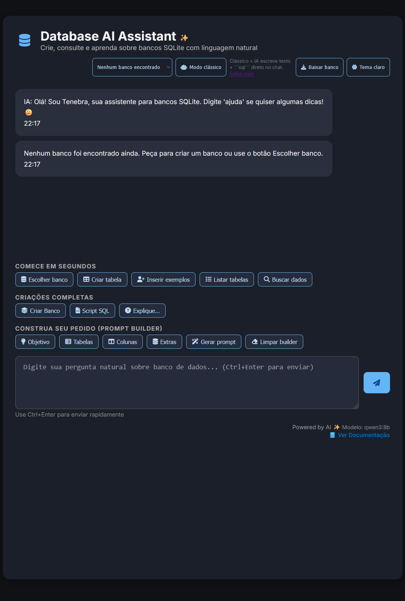
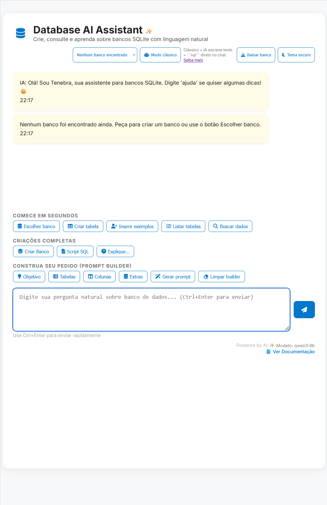

# Tenebra DB ✨

<div align="center">
  <br>
  <i>A assistente de banco de dados SQLite mais segura, bonita e brasileira que existe</i>
  <br><br>
  
  [](https://adoptium.net)
  [](https://quarkus.io)
  [](https://ollama.com)
  [](https://sqlite.org)
  <br>
  [](https://github.com/ropcastr/tenebra-db/stargazers)
  [](https://github.com/ropcastr/tenebra-db/network/members)
  <br>
  <sub>Feito com ❤️ por um aluno do curso de Banco de Dados da FATEC São José dos Campos</sub>
</div>

<br>

**Fale naturalmente. Ela entende até:**

> "usar o banco vendas e cria uma tabela de clientes com nome e email aí rapidinho"

E ela responde com SQL perfeito, executa com segurança e ainda traduz erros técnicos para português humano.
Perfeita para iniciantes e avançados!

## O que ela faz
- Cria e organiza bancos de dados SQLite (arquivos .db) em uma pasta segura
- Cria tabelas/colunas, insere dados de exemplo e consulta informações
- Bloqueia comandos perigosos e pede confirmação explícita
- Responde em linguagem natural, com blocos ```sql``` prontos para executar
- Interface web simples (SPA) com tema claro/escuro, botões de ação guiadas e construtor de prompts
- Botão para exportar o banco atual (.db) direto no navegador
- **Novo:** Alterna entre modo "Clássico" (texto + blocos ```sql```) e modo "Estruturado" (IA envia explicação + SQL puro separado) direto na interface


## ✨ Recursos que ninguém mais tem

| Recurso                        | Descrição |
|--------------------------------|---------|
| **Modo Estruturado (JSON)**    | IA devolve explicação + SQL puro separado (mais seguro que qualquer ferramenta atual) |
| **Dropdown de bancos**         | Veja e troque de banco com um clique |
| **Botão "Copiar SQL"**         | Em todos os blocos de código |
| **Download do .db**            | Exporte seu banco com um clique |
| **Erros em português humano**  | "A tabela Clientes já existe" em vez de erro técnico |
| **Confirmação dupla**          | Nunca apaga nada por acidente |
| **Tema dark/light**            | Persistente e lindo |
| **Prompt builder**             | Monte prompts complexos clicando em botões |
| **100% offline**               | Tudo roda local com Ollama |

## 🖼️ Screenshots

<div align="center">
  
  
  <br><br>
</div>

## Pré‑requisitos

### 🎯 Para rodar o executável (.Jar)

1. **Java 21 ou superior** (JDK - Java Development Kit)
   - Baixe em: https://adoptium.net ou https://www.oracle.com/java/technologies/downloads/
   - Após instalar, teste no terminal: `java -version`
   - Deve mostrar algo como "openjdk version 21..." ou "java version 21..."

3. **Ollama** (servidor de modelos de IA locais)
   - Baixe e instale em: https://ollama.com
   - Após instalar, o Ollama roda automaticamente em segundo plano
   - Você pode verificar se está rodando acessando: http://localhost:11434

4. **Escolha um modelo de IA**
   - O projeto vem configurado para usar `qwen3:8b` (recomendado para começar)
   - Baixe o modelo com o comando:
     ```bash
     ollama pull qwen3:8b
     ```

#### ⚡ Como usar (30 segundos)

1. Baixe o JAR da última release → [Download v1.0.0](https://github.com/seu-usuario/tenebra-db/releases/latest)
2. Tenha o Ollama rodando com um modelo (ex: `ollama pull qwen3:8b`)
3. Execute:
```bash
java -jar tenebra-db-1.0.0.jar
```
4. Abra http://localhost:8080 e fale naturalmente!

### 🛠️ Para desenvolveres

1. **Java 21 ou superior** (JDK - Java Development Kit)
   - Baixe em: https://adoptium.net ou https://www.oracle.com/java/technologies/downloads/
   - Após instalar, teste no terminal: `java -version`
   - Deve mostrar algo como "openjdk version 21..." ou "java version 21..."

2. **Maven 3.9 ou superior** (ferramenta de build do Java)
   - Baixe em: https://maven.apache.org/download.cgi
   - Siga o guia de instalação: https://maven.apache.org/install.html
   - Teste no terminal: `mvn -version`

3. **Ollama** (servidor de modelos de IA locais)
   - Baixe e instale em: https://ollama.com
   - Após instalar, o Ollama roda automaticamente em segundo plano
   - Você pode verificar se está rodando acessando: http://localhost:11434

4. **Escolha um modelo de IA**
   - O projeto vem configurado para usar `qwen3:8b` (recomendado para começar)
   - Baixe o modelo com o comando:
     ```bash
     ollama pull qwen3:8b
     ```
   - **IMPORTANTE**: Você pode usar QUALQUER modelo disponível no Ollama!
   - Para ver modelos disponíveis: https://ollama.com/library
   - Modelos populares: `llama3:8b`, `mistral:7b`, `codellama:13b`, `phi3:mini`
   - Para trocar de modelo, veja a seção "Como trocar o modelo de IA" abaixo

#### Como rodar
- Clonar o repositório
  ```Bash
  git clone https://github.com/ropcastr/tenebra-db.git
  ```
- Modo dev (hot reload):
  ```bash
  cd tenebra-db
  mvn quarkus:dev
  ```
- Modo pacote (JAR único):
  ```bash
  mvn clean package
  java -jar target/quarkus-bot-db-1.0.0-SNAPSHOT-runner.jar
  ```
- Para desativar a abertura automática do navegador:
  ```bash
  java -Dtenebra.browser.auto-open=false -jar target/quarkus-bot-db-1.0.0-SNAPSHOT-runner.jar
  ```

Acesse http://localhost:8080

## Como usar pela primeira vez (guia passo a passo)

### 1. Inicie a aplicação

**Opção A - Modo desenvolvimento (recomendado para testar):**
```bash
# Abra o terminal na pasta do projeto
cd C:\Users\SeuUsuario\quarkus-bot-db

# Execute o comando
mvn quarkus:dev
```
Aguarde aparecer a mensagem "Listening on: http://localhost:8080"

**Opção B - Executável compilado (para usar em produção):**
```bash
# Primeiro, compile o projeto (pode demorar alguns minutos na primeira vez)
mvn clean package

# Depois execute o JAR gerado
java -jar target/quarkus-bot-db-1.0.0-SNAPSHOT-runner.jar
```

### 2. Acesse no navegador
- O navegador deve abrir automaticamente em `http://localhost:8080`
- Se não abrir, digite esse endereço manualmente no navegador
- Você verá a interface da Tenebra com uma caixa de texto grande

### 3. Escolha ou crie um banco de dados
Digite sua primeira mensagem (copie e cole se quiser):
```
usar o banco vendas
```
**O que acontece:** A Tenebra cria um arquivo chamado `vendas.db` na pasta `data/` do projeto e confirma que está pronta para trabalhar com ele.

### 4. Crie sua primeira tabela
Digite:
```
no banco atual, crie uma tabela Clientes com as colunas nome e email
```
**O que acontece:** A Tenebra mostra o código SQL gerado (dentro de um bloco cinza) e confirma que a tabela foi criada com sucesso.

### 5. Adicione dados de exemplo
Digite:
```
adicione alguns clientes de exemplo nessa tabela
```
**O que acontece:** A Tenebra insere automaticamente alguns dados fictícios (nomes e emails) para você começar a trabalhar.

### 6. Consulte os dados
Digite:
```
mostre todos os clientes
```
**O que acontece:** Você verá uma tabela HTML bonita com todos os clientes cadastrados (nome e email).

### 7. Continue explorando!

Alguns comandos úteis para você testar:
- `"mostre as tabelas"` — lista todas as tabelas do banco atual
- `"banco atual"` — mostra qual banco você está usando agora
- `"liste os bancos"` — mostra todos os arquivos .db que você já criou
- `"crie uma tabela Produtos com nome, preco e quantidade"` — crie mais tabelas
- `"adicione um produto notebook com preco 2500"` — insira dados específicos
- `"mostre produtos com preco maior que 1000"` — faça consultas filtradas

**Dica:** Fale naturalmente! A Tenebra entende português informal:
- "bota uma tabela de funcionários"
- "me mostra os clientes"
- "adiciona mais 3 produtos aí"

## Modos de resposta da IA (Clássico vs Estruturado)
Na parte superior direita da interface existe o botão **Modo clássico / Modo estruturado** com um pequeno texto de apoio. Você decide como a IA deve responder:

| Modo | Como aparece | Quando usar |
|------|--------------|-------------|
| **Clássico** (padrão) | A IA escreve uma explicação em linguagem natural seguida de um bloco ```sql``` completo. | Ideal para testar rapidamente, copiar respostas ou quando estiver validando prompts. |
| **Estruturado** | A IA devolve um JSON interno (explicação + SQL puro). O backend exibe a explicação e o SQL em blocos separados e executa somente o SQL fornecido. | Útil para maior previsibilidade, auditoria e quando se quer evitar erros de formatação (principalmente em LLMs menores). |

- O modo pode ser trocado a qualquer momento; a próxima mensagem já usará o formato escolhido.
- Se o modelo não suportar bem o modo estruturado, o backend registra nos logs e volta automaticamente ao modo clássico para evitar travamentos.
- A API expõe `GET /chat/mode` e `POST /chat/mode` para integrações externas mudarem o modo sem usar a interface.

## Importante sobre operações perigosas

A Tenebra protege você de apagar dados por acidente. Se você tentar fazer algo destrutivo, ela vai pedir confirmação:

**Exemplo 1 - Deletar dados:**
```
Você: delete todos os clientes
Tenebra: ⚠️ Operação bloqueada: confirme digitando 'confirmar delete' antes...

Você: confirmar delete
Tenebra: ✓ Operações destrutivas liberadas para a próxima instrução. Faça sua pergunta agora.

Você: delete todos os clientes
Tenebra: [Executa o DELETE e mostra "Linhas afetadas: 5"]
```

**Exemplo 2 - Apagar um banco inteiro:**
```
Você: apague o banco vendas
Tenebra: ⚠️ Confirme digitando: 'confirmar apagar vendas'

Você: confirmar apagar vendas
Tenebra: ✓ Banco vendas removido. Pode escolher outro banco para continuar.
```

A confirmação é válida **apenas para a próxima instrução** da sua sessão, depois ela expira automaticamente por segurança.

## Dicas de uso (referência rápida)
- Escolher/criar banco: `"usar o banco vendas"` → cria `vendas.db` em `data/`
- **Importante:** Ao mencionar o banco, use um nome específico e único (ex: "vendas", "clientes2024", "estoque_loja")
- Evite usar palavras genéricas como "banco", "dados", "tabela" como nome do banco
- Ver banco atual: `"banco atual"`
- Criar tabela: `"no banco atual, crie a tabela Clientes com nome e email"`
- Inserir exemplos: `"coloque alguns clientes de exemplo"`
- Inserir específico: `"adicione um cliente chamado João com email joao@email.com"`
- Listar tabelas: `"mostre as tabelas"` ou `"liste tabelas"`
- Listar bancos: `"liste os bancos"` ou `"mostre bancos"`
- Consultar dados: `"mostre todos os clientes"` ou `"selecione clientes"`
- Confirmar ação destrutiva: `"confirmar delete"` (vale para a próxima instrução)
- Apagar arquivo do banco: `"apague o banco vendas"` → `"confirmar apagar vendas"`

## Segurança (importante)
- Execução restrita ao banco selecionado na sessão (a IA não troca de banco)
- Comandos proibidos: ATTACH, DETACH, PRAGMA, CREATE DATABASE, USE
- Confirmação obrigatória para DROP/TRUNCATE/ALTER ... DROP/DELETE
- SELECT sem LIMIT recebe LIMIT 1000 automaticamente (protege performance)
- Timeout de consulta configurado (30s)
- Respostas da IA e dados renderizados com escape de HTML para evitar XSS

## Configurações

### Arquivo principal de configuração
Todas as configurações ficam em: `src/main/resources/application.properties`

```properties
# Quanto tempo esperar pela resposta da IA (em segundos)
quarkus.langchain4j.ollama.timeout=180s

# Qual modelo de IA usar (você pode trocar!)
quarkus.langchain4j.ollama.chat-model.model-id=qwen3:8b

# Nível de log (DEBUG mostra mais detalhes, INFO mostra menos)
logging.level.dev.langchain4j=DEBUG

# Habilita servir arquivos estáticos (a interface web)
quarkus.http.static-resources.enable=true
quarkus.http.static-resources.paths=/

# Abre o navegador automaticamente ao iniciar (true/false)
# Desative com -Dtenebra.browser.auto-open=false na linha de comando
tenebra.browser.auto-open=true

# Quantidade máxima de mensagens mantidas no histórico de cada sessão
tenebra.history.max-size=30

# Habilita o modo estruturado da IA na inicialização (pode ser trocado em tempo real via /chat/mode ou pelo botão da UI)
tenebra.ai.structured=false
```

### Como trocar o modelo de IA

**Passo 1**: Escolha um modelo no catálogo do Ollama
- Acesse: https://ollama.com/library
- Exemplos populares:
  - `llama3:8b` — modelo da Meta, muito equilibrado
  - `mistral:7b` — rápido e eficiente
  - `codellama:13b` — especializado em código
  - `phi3:mini` — leve e rápido
  - `qwen3:8b` — ótimo para textos e raciocínio (padrão do projeto)

**Passo 2**: Baixe o modelo escolhido
```bash
ollama pull llama3:8b
# ou qualquer outro modelo que você escolheu
```

**Passo 3**: Edite o arquivo `src/main/resources/application.properties`
- Abra o arquivo com qualquer editor de texto
- Encontre a linha:
  ```
  quarkus.langchain4j.ollama.chat-model.model-id=qwen3:8b
  ```
- Troque `qwen3:8b` pelo nome do modelo que você baixou:
  ```
  quarkus.langchain4j.ollama.chat-model.model-id=llama3:8b
  ```

**Passo 4**: Reinicie a aplicação
- Se estiver rodando, pare (Ctrl+C no terminal)
- Inicie novamente com `mvn quarkus:dev` ou execute o JAR novamente

Pronto! A Tenebra agora usará o novo modelo.

### Outras configurações úteis

**Novo:** Baixar banco atual via API (útil em automações):
```
curl -o meu-banco.db "http://localhost:8080/db/download?db=vendas.db"
```

**Mudar onde os bancos de dados são salvos:**
```bash
# Windows
set TENEBRA_DB_DIR=C:\MeusProjetos\bancos
java -jar target/quarkus-bot-db-1.0.0-SNAPSHOT-runner.jar

# Linux/Mac
export TENEBRA_DB_DIR=/home/usuario/meus-bancos
java -jar target/quarkus-bot-db-1.0.0-SNAPSHOT-runner.jar

# Ou via linha de comando (qualquer sistema)
java -Dtenebra.db.dir=C:\meus-bancos -jar target/quarkus-bot-db-1.0.0-SNAPSHOT-runner.jar
```

**Mudar a porta do servidor:**
```bash
# Roda na porta 9090 ao invés da padrão (8080)
java -Dquarkus.http.port=9090 -jar target/quarkus-bot-db-1.0.0-SNAPSHOT-runner.jar
```

**Desativar abertura automática do navegador:**
```bash
java -Dtenebra.browser.auto-open=false -jar target/quarkus-bot-db-1.0.0-SNAPSHOT-runner.jar
```

**Aumentar o tempo de espera da IA (se o modelo for lento):**
- Edite `application.properties` e mude:
  ```
  quarkus.langchain4j.ollama.timeout=300s
  ```
  (300 segundos = 5 minutos)

## Endpoints REST
- `POST /chat` — conversa completa com IA + execução de SQL
- `GET /chat/welcome` — mensagem inicial
- `GET /chat/model` — mostra o modelo configurado
- `GET /chat/mode` e `POST /chat/mode` — consulta/define o modo (clássico x estruturado)
- `GET /db/query?db=...&sql=SELECT ...` — consulta segura (apenas 1 SELECT sem `;`)
- `GET /docs` — documentação renderizada com suporte a Mermaid
- `GET /test` — health‑check simples
- `GET /db/download?db=nome.db` — baixa o arquivo SQLite atual

Exemplo:
```bash
curl -X POST http://localhost:8080/chat \
  -H "Content-Type: application/json" \
  -d '{"message":"usar o banco vendas","sessionId":"demo"}'
```

## Como a arquitetura funciona (resumo)
- Front‑end (index.html) envia mensagens para `/chat`, exibe respostas e resultados
- `ChatResource` orquestra: histórico da sessão, detecção de banco, chamada à IA, execução SQL e montagem da resposta segura
- `TenebraAIService` define as regras de comportamento (System Prompt) e conversa com o modelo local (via LangChain4j + Ollama)
- `SqlExecutor` encontra blocos ```sql``` na resposta da IA e executa com guard‑rails (transação, bloqueios, LIMIT, timeout)
- `DatabaseUtil` cuida de caminhos e operações de arquivo/SQLite, lista bancos/tabelas com escape de HTML
- `HistoryManager` guarda o contexto por `sessionId` e confirmação de comandos destrutivos
- `NaturalLanguageDictionary` entende intents simples (ajuda, listar bancos/tabelas, confirmar exclusões, etc.) com sinônimos
- `DocsResource` renderiza DOCUMENTACAO.MD em HTML com CSS + Mermaid (com escape e CSP mínimos)
- `BrowserLauncher` (configurável) tenta abrir o navegador automaticamente na inicialização
- Interface web agora possui: modo escuro, indicador de carregamento, download do banco e construtor de prompts
- `DatabaseDownloadResource` expõe o endpoint `/db/download`
- `HistoryManager` mantém até 30 mensagens (configurável)
- `ErrorMessageService` traduz erros SQL para mensagens amigáveis

## Dependências principais
- Quarkus 3.27.x (REST, CDI)
- LangChain4j + Quarkus LangChain4j Ollama (integração com modelos locais)
- SQLite JDBC `org.xerial:sqlite-jdbc:3.45.3.0`
- CommonMark (Markdown + tabelas GFM)

As versões estão no `pom.xml` e podem ser atualizadas conforme necessidade.

## Problemas comuns e soluções

### 1. "Modelo não encontrado" ou erro ao conectar com Ollama

**Sintomas:** A aplicação inicia mas quando você tenta conversar aparece erro de conexão ou timeout.

**Causas possíveis:**
- O Ollama não está rodando
- O modelo não foi baixado
- Você configurou um modelo que não existe

**Soluções:**
1. Verifique se o Ollama está rodando:
   - Acesse http://localhost:11434 no navegador
   - Se aparecer "Ollama is running", está ok
   - Se não aparecer nada, abra o Ollama (ícone na bandeja do sistema)

2. Baixe o modelo configurado:
   ```bash
   ollama pull qwen3:8b
   ```

3. Veja quais modelos você já tem:
   ```bash
   ollama list
   ```

4. Se o modelo no `application.properties` não estiver na lista, baixe ele ou troque para um que você já tem.

### 2. "Permissão negada" ao criar banco de dados

**Sintomas:** Erro ao tentar criar ou acessar arquivos `.db`.

**Causa:** A pasta `data/` não tem permissão de escrita.

**Solução:**
- **Opção A:** Execute a aplicação com permissões de administrador
- **Opção B:** Mude o diretório dos bancos para uma pasta sua:
  ```bash
  # Windows
  java -Dtenebra.db.dir=C:\MeusProjetos\bancos -jar target/quarkus-bot-db-1.0.0-SNAPSHOT-runner.jar
  
  # Linux/Mac
  java -Dtenebra.db.dir=/home/usuario/bancos -jar target/quarkus-bot-db-1.0.0-SNAPSHOT-runner.jar
  ```

### 3. "Operação bloqueada" ao tentar deletar dados

**Sintomas:** A Tenebra responde "Operação bloqueada: confirme digitando 'confirmar delete'..."

**Causa:** Proteção de segurança ativada (comportamento normal).

**Solução:** Digite exatamente `confirmar delete`, depois repita seu comando:
```
Você: confirmar delete
Você: delete todos os produtos
```

### 4. Navegador não abre automaticamente

**Sintomas:** A aplicação inicia mas o navegador não abre.

**Causas possíveis:**
- Você está em um servidor sem interface gráfica
- Problema com o Java Desktop

**Solução:**
- Abra o navegador manualmente: `http://localhost:8080`
- Ou desative a tentativa automática:
  ```bash
  java -Dtenebra.browser.auto-open=false -jar target/quarkus-bot-db-1.0.0-SNAPSHOT-runner.jar
  ```

### 5. Porta 8080 já está em uso

**Sintomas:** Erro ao iniciar: "Port 8080 already in use" ou "Address already in use".

**Causa:** Outro programa está usando a porta 8080.

**Solução:** Use outra porta:
```bash
# Tenta a porta 9090
java -Dquarkus.http.port=9090 -jar target/quarkus-bot-db-1.0.0-SNAPSHOT-runner.jar

# Depois acesse: http://localhost:9090
```

### 6. A IA responde mas o SQL não executa

**Sintomas:** A Tenebra gera o bloco ```sql``` mas não executa ou dá erro.

**Causas possíveis:**
- SQL incompatível com SQLite
- Nome de tabela ou coluna errado
- Banco não foi selecionado

**Soluções:**
1. Verifique se você selecionou um banco:
   ```
   banco atual
   ```
   Se responder "Nenhum banco selecionado", escolha um:
   ```
   usar o banco teste
   ```

2. Veja se a tabela existe:
   ```
   mostre as tabelas
   ```

3. Se o SQL tiver erro de sintaxe, peça para a IA corrigir:
   ```
   o comando anterior deu erro, pode corrigir?
   ```

### 7. Respostas muito lentas ou timeout

**Sintomas:** A IA demora muito (mais de 3 minutos) ou dá erro de timeout.

**Causas possíveis:**
- Modelo muito grande para seu computador
- Hardware limitado
- Timeout configurado muito baixo

**Soluções:**
1. Use um modelo mais leve:
   ```bash
   ollama pull phi3:mini
   ```
   E troque no `application.properties`:
   ```
   quarkus.langchain4j.ollama.chat-model.model-id=phi3:mini
   ```

2. Aumente o timeout no `application.properties`:
   ```
   quarkus.langchain4j.ollama.timeout=300s
   ```

3. Feche outros programas pesados que estejam usando CPU/memória.

### 8. "mvn" não é reconhecido como comando

**Sintomas:** Ao tentar executar `mvn quarkus:dev` aparece erro.

**Causa:** Maven não está instalado ou não está no PATH do sistema.

**Solução:**
1. Instale o Maven: https://maven.apache.org/install.html
2. Adicione ao PATH do sistema
3. Reinicie o terminal
4. Teste: `mvn -version`

### 9. Banco de dados corrompido ou com problema

**Sintomas:** Erros estranhos ao consultar dados, mensagens sobre "database disk image is malformed".

**Solução:**
1. Feche a aplicação (Ctrl+C)
2. Navegue até a pasta `data/`
3. Renomeie o banco problemático: `vendas.db` → `vendas.db.backup`
4. Reinicie a aplicação e crie um novo banco

### 10. Não consigo baixar o banco
- Certifique-se de ter selecionado um banco antes (com "usar o banco ...")
- O botão "Baixar banco" só habilita quando há um banco ativo
- Via linha de comando, use `curl http://localhost:8080/db/download?db=vendas.db -o vendas.db`

### Ainda com problemas?

Se nenhuma solução acima funcionou:
1. Verifique o log no terminal onde a aplicação está rodando
2. Procure por mensagens de erro em vermelho
3. Copie a mensagem de erro completa
4. Abra uma issue no GitHub do projeto com:
   - Sistema operacional (Windows/Linux/Mac)
   - Versão do Java (`java -version`)
   - Versão do Maven (`mvn -version`)
   - Modelo Ollama configurado
   - Mensagem de erro completa
   - Passos para reproduzir o problema

## Roadmap curto
- Perfis de somente leitura
- Suporte a múltiplos modelos por sessão
- Exportação de histórico
- Métricas/observabilidade


## 📄 Licença
MIT © 2025 - Rodrigo Castro

Para guias detalhados (classes, métodos, fluxo completo e diagramas), abra a documentação em `/docs` ou veja [DOCUMENTACAO](src/main/resources/DOCUMENTACAO.MD).
  


  Feito para quem acha que banco de dados é coisa chata.
Nós provamos que pode ser mágico ✨
