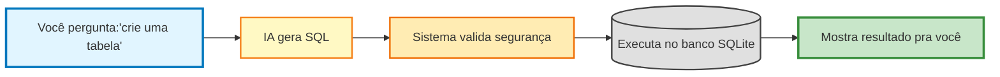
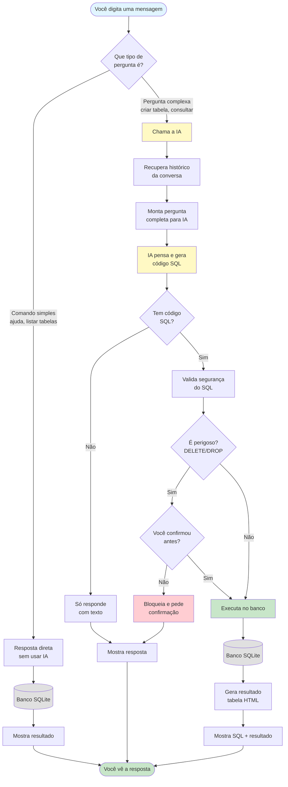
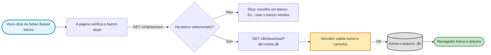

# Documentação da Aplicação em Quarkus - Tenebra AI Database Assistant!

> Um assistente de bancos SQLite com IA, feito para que qualquer pessoa – mesmo iniciantes – consiga criar, consultar e gerenciar dados falando em linguagem natural.

---

## 📚 Índice rápido
1. [Visão geral e objetivos](#1-visao-geral-e-objetivos)
2. [Tecnologias e conceitos usados](#2-tecnologias-e-conceitos-usados)
3. [Pré-requisitos e ambiente](#3-pre-requisitos-e-ambiente)
4. [Estrutura do projeto](#4-estrutura-do-projeto)
5. [Dependências Maven explicadas](#5-dependencias-maven-explicadas)
6. [Configurações importantes](#6-configuracoes-importantes)
7. [Como executar e compilar](#7-como-executar-e-compilar)
8. [Fluxo completo de funcionamento](#8-fluxo-completo-de-funcionamento)
9. [Endpoints REST disponíveis](#9-endpoints-rest-disponiveis)
10. [Entendendo as anotações do Quarkus/Jakarta](#10-entendendo-as-anotacoes-do-quarkusjakarta)
11. [Guia classe a classe (com métodos)](#11-guia-classe-a-classe-com-metodos)
12. [Interface web (index.html)](#12-interface-web-indexhtml)
13. [Segurança e validações](#13-seguranca-e-validacoes)
14. [Como estender e melhorar](#14-como-estender-e-melhorar)
15. [Resolução de problemas comuns](#15-resolucao-de-problemas-comuns)
16. [Glossário rápido](#16-glossario-rapido)

---

## 1. Visao geral e objetivos
Tenebra é uma REST API feita com Quarkus que conversa com um modelo de IA local via Ollama (usando LangChain4j). Você digita algo como “crie a tabela clientes” e o sistema:
1. Entende a intenção (qual banco, que ação fazer)
2. Pede para a IA gerar SQL compatível com SQLite dentro de blocos ```sql```
3. Valida e executa esse SQL com segurança
4. Retorna o resultado formatado na interface web

O foco é ser simples, seguro e didático:
- Linguagem natural, para qualquer nível de usuário
- Confirmações antes de ações destrutivas
- Histórico de sessão para manter contexto
- Interface web intuitiva e endpoints REST para integração

---

## 2. Tecnologias e conceitos usados
| Tecnologia | Onde é usada | Por que é importante |
|------------|--------------|----------------------|
| Quarkus | Framework Java que expõe os endpoints REST e gerencia injeção de dependências | Inicia rápido, ideal para microsserviços |
| Jakarta REST (JAX-RS) | Define endpoints com `@Path`, `@GET`, `@POST` | Padrão para criar APIs HTTP em Java |
| LangChain4j + Quarkus LangChain4j Ollama | Integração com modelos locais do Ollama | A IA cria SQL a partir de linguagem natural |
| SQLite JDBC | Banco de dados leve baseado em arquivo `.db` | Fácil de usar e distribuir |
| CommonMark | Renderiza esta documentação em `/docs` | Permite ler a doc direto no navegador |

Conceitos básicos:
- REST: API via URLs e verbos HTTP (GET/POST)
- JSON: formato leve para dados
- Injeção de dependência: Quarkus cria objetos para você (`@Inject`)

---

## 3. Pre-requisitos e ambiente

### O que você precisa ter instalado

1. **Java 21 ou superior** (JDK - Java Development Kit)
   - **O que é:** O Java é a linguagem de programação usada neste projeto
   - **Onde baixar:** https://adoptium.net (recomendado) ou https://www.oracle.com/java/technologies/downloads/
   - **Como verificar:** Após instalar, abra o terminal e digite: `java -version`
   - **Deve mostrar:** Algo como "openjdk version 21..." ou "java version 21..."
   - **Nota:** Se mostrar uma versão menor (como 17 ou 11), você precisa atualizar

2. **Maven 3.9 ou superior** (ferramenta de build e gerenciamento de dependências)
   - **O que é:** Maven é como um "organizador" que baixa bibliotecas e compila o projeto
   - **Onde baixar:** https://maven.apache.org/download.cgi
   - **Guia de instalação:** https://maven.apache.org/install.html
   - **Como verificar:** Digite no terminal: `mvn -version`
   - **Deve mostrar:** "Apache Maven 3.9..." ou superior
   - **Importante:** O Maven precisa estar no PATH do sistema (o guia de instalação explica isso)

3. **Ollama** (servidor de modelos de IA locais)
   - **O que é:** Ollama é um programa que roda modelos de IA no seu próprio computador (sem enviar dados para a internet)
   - **Onde baixar:** https://ollama.com
   - **Como funciona:** Depois de instalar, o Ollama fica rodando em segundo plano
   - **Como verificar:** Abra o navegador e acesse http://localhost:11434
   - **Deve mostrar:** A mensagem "Ollama is running"
   - **Solução de problemas:** Se não aparecer nada, procure o ícone do Ollama na bandeja do sistema e clique para iniciar

4. **Baixe um modelo de IA**
   - **O que é:** Um modelo de IA é como o "cérebro" que entende suas perguntas e gera SQL
   - **Modelo padrão:** O projeto vem configurado para `qwen3:8b`
   - **Como baixar:** Digite no terminal:
     ```bash
     ollama pull qwen3:8b
     ```
     (Vai demorar alguns minutos dependendo da sua internet - o arquivo tem cerca de 4-5GB)
   
   - **Você pode usar QUALQUER modelo!** Não está preso ao padrão.
   - **Onde ver modelos disponíveis:** https://ollama.com/library
   - **Modelos populares:**
     - `llama3:8b` — modelo da Meta/Facebook, muito equilibrado (4.7GB)
     - `mistral:7b` — rápido e eficiente para hardware mais fraco (4.1GB)
     - `codellama:13b` — especializado em código (7.4GB)
     - `phi3:mini` — muito leve, roda até em notebooks mais fracos (2.3GB)
     - `qwen3:8b` — ótimo para português e raciocínio (padrão - 4.7GB)
   
   - **Como trocar de modelo:** Veja a seção "6. Configurações importantes" mais abaixo

### Ferramentas opcionais mas úteis

- **sqlite3** (cliente de linha de comando para SQLite)
  - Útil para inspecionar os bancos `.db` manualmente
  - Windows: https://www.sqlite.org/download.html
  - Linux: geralmente já vem instalado, ou `sudo apt install sqlite3`
  - Mac: já vem instalado

- **Editor de código** (para visualizar/editar os arquivos do projeto)
  - VS Code (recomendado): https://code.visualstudio.com
  - IntelliJ IDEA Community: https://www.jetbrains.com/idea/download/
  - Notepad++: https://notepad-plus-plus.org (Windows)
  - Qualquer editor de texto funciona, mas IDEs facilitam muito

---

## 4. Estrutura do projeto
```
.
├── pom.xml                    # Arquivo de configuração do Maven
├── README.md                  # Guia rápido de uso
├── data/                      # Diretório onde os bancos .db são salvos
├── src/
│   ├── main/
│   │   ├── java/br/fatec/
│   │   │   ├── BrowserLauncher.java          # Abre navegador automaticamente
│   │   │   ├── ChatResource.java             # Endpoint principal /chat
│   │   │   ├── DatabaseDetector.java         # Detecta nomes de banco em linguagem natural
│   │   │   ├── DatabaseDownloadResource.java # Endpoint /db/download
│   │   │   ├── DatabaseResource.java         # Endpoint /db/query
│   │   │   ├── DatabaseUtil.java             # Operações com arquivos .db
│   │   │   ├── DocsResource.java             # Renderiza /docs
│   │   │   ├── ErrorMessageService.java      # Traduz erros SQL para português
│   │   │   ├── HistoryManager.java           # Gerencia histórico por sessão
│   │   │   ├── HtmlUtil.java                 # Utilitários de segurança HTML
│   │   │   ├── NaturalLanguageDictionary.java # Detecta intents em português
│   │   │   ├── SqlExecutor.java              # Executa SQL com segurança
│   │   │   ├── TenebraAIService.java         # Interface com a IA (LangChain4j)
│   │   │   ├── AiModeService.java           # Controla se o modo estruturado está ligado
│   │   │   ├── TenebraStructuredResponse.java # DTO usado quando o modo estruturado está ativo
│   │   │   └── TestResource.java             # Endpoint /test (health-check)
│   │   └── resources/
│   │       ├── application.properties        # Configurações da aplicação
│   │       ├── DOCUMENTACAO.MD              # Este arquivo (documentação técnica)
│   │       └── META-INF/
│   │           └── resources/
│   │               └── index.html           # Interface web (SPA)
│   └── test/
│       └── java/br/fatec/
│           └── TestDatabaseDetector.java    # Testes do DatabaseDetector
└── target/                    # Gerado pelo Maven (arquivos compilados)
```

**Explicação para iniciantes:**

- **pom.xml**: É como uma "lista de compras" que diz ao Maven quais bibliotecas (dependências) baixar
- **data/**: Pasta criada automaticamente onde seus bancos `.db` ficam salvos
- **src/main/java/**: Código-fonte Java da aplicação (onde fica a lógica)
- **src/main/resources/**: Arquivos de configuração e recursos estáticos
- **target/**: Pasta temporária criada quando você compila (pode deletar, será recriada)

---

## 5. Dependências Maven explicadas
Principais trechos do `pom.xml` (resumo comentado):
- `io.quarkus:quarkus-rest` + `quarkus-rest-jackson`: endpoints REST/JSON
- `io.quarkus:quarkus-arc`: CDI/injeção de dependência
- `io.quarkiverse.langchain4j:quarkus-langchain4j-ollama`: integra com Ollama
- `org.xerial:sqlite-jdbc:3.45.3.0`: driver SQLite
- `org.commonmark:commonmark` e `commonmark-ext-gfm-tables`: render de Markdown

Você pode atualizar versões no `pom.xml` conforme necessidade.

---

## 6. Configurações importantes

### Onde ficam as configurações
Todas as configurações da aplicação estão no arquivo: `src/main/resources/application.properties`

Você pode editar esse arquivo com qualquer editor de texto (Bloco de Notas, VS Code, etc.).

### Entendendo cada configuração

```properties
# Quanto tempo esperar pela resposta da IA (em segundos)
# Se o modelo for lento ou seu computador fraco, aumente esse valor
quarkus.langchain4j.ollama.timeout=180s

# Qual modelo de IA usar
# Você pode trocar para qualquer modelo disponível no Ollama
# Exemplos: llama3:8b, mistral:7b, phi3:mini, codellama:13b
quarkus.langchain4j.ollama.chat-model.model-id=qwen3:8b

# Nível de detalhamento dos logs (mensagens no terminal)
# DEBUG = mostra tudo (útil para descobrir problemas)
# INFO = mostra apenas informações importantes
# WARN = mostra apenas avisos e erros
logging.level.dev.langchain4j=DEBUG
 
# Habilita o servidor servir a interface web (index.html)
# Se mudar para false, você só consegue usar via API REST
quarkus.http.static-resources.enable=true
quarkus.http.static-resources.paths=/
 
# Abre o navegador automaticamente ao iniciar a aplicação
# true = abre automaticamente
# false = você precisa abrir manualmente (útil em servidores)
tenebra.browser.auto-open=true
 
# Quantidade máxima de mensagens guardadas por sessão (ajuda IA a manter contexto)
tenebra.history.max-size=30

# Ativa o modo estruturado da IA na inicialização (o usuário pode alternar depois)
tenebra.ai.structured=false
```

---

## 7. Como executar e compilar

### Entendendo os modos de execução

Existem dois modos principais de rodar a aplicação:

#### Modo 1: Desenvolvimento (Hot Reload)
**Use quando:** Está desenvolvendo/testando e quer ver mudanças instantâneas
**Vantagem:** Qualquer alteração no código é aplicada automaticamente
**Desvantagem:** Consome mais recursos (CPU/RAM)

```bash
# Abra o terminal na pasta raiz do projeto
cd C:\Users\SeuUsuario\quarkus-bot-db

# Execute
mvn quarkus:dev
```

**O que acontece:**
1. Maven baixa todas as dependências necessárias (primeira vez pode demorar)
2. Compila o código Java
3. Inicia o Quarkus
4. Exibe "Listening on: http://localhost:8080"
5. O navegador abre automaticamente (se configurado)

**Como parar:** Aperte `Ctrl+C` no terminal

#### Modo 2: Produção (Executável compilado)
**Use quando:** Quer distribuir ou rodar em produção
**Vantagem:** Mais rápido e eficiente, não precisa do Maven instalado para rodar
**Desvantagem:** Precisa recompilar sempre que mudar algo

```bash
# Passo 1: Compile o projeto (gera um JAR único)
mvn clean package

# O que acontece:
# - "clean" limpa compilações antigas
# - "package" compila e empacota tudo em um arquivo JAR
# - Vai demorar alguns minutos na primeira vez
# - Cria o arquivo: target/quarkus-bot-db-1.0.0-SNAPSHOT-runner.jar

# Passo 2: Execute o JAR
java -jar target/quarkus-bot-db-1.0.0-SNAPSHOT-runner.jar
```

**Como parar:** Aperte `Ctrl+C` no terminal

### Seu primeiro uso (passo a passo detalhado)

#### Passo 1: Abra o terminal
- **Windows:** Aperte `Win+R`, digite `cmd` e aperte Enter
- **Mac:** Aperte `Cmd+Espaço`, digite `terminal` e aperte Enter
- **Linux:** Aperte `Ctrl+Alt+T`

#### Passo 2: Navegue até a pasta do projeto
```bash
# Windows exemplo:
cd C:\Users\SeuNome\Downloads\quarkus-bot-db

# Linux/Mac exemplo:
cd /home/seuNome/projetos/quarkus-bot-db
```

**Dica:** Se não sabe onde está a pasta, arraste a pasta para a janela do terminal que o caminho aparece automaticamente.

#### Passo 3: Inicie a aplicação

Para começar, recomendamos o modo desenvolvimento:
```bash
mvn quarkus:dev
```

**Aguarde ver essa mensagem:**
```
__  ____  __  _____   ___  __ ____  ______ 
 --/ __ \/ / / / _ | / _ \/ //_/ / / / __/ 
 -/ /_/ / /_/ / __ |/ , _/ ,< / /_/ /\ \   
--\___\_\____/_/ |_/_/|_/_/|_|\____/___/   
...
Listening on: http://localhost:8080
```

#### Passo 4: Acesse a interface web

**Opção A:** O navegador deve abrir automaticamente mostrando a Tenebra

**Opção B:** Se não abrir, abra seu navegador favorito e digite na barra de endereços:
```
http://localhost:8080
```

Você verá:
- Um cabeçalho azul "Database AI Assistant"
- Botões de atalho na parte de cima
- Uma caixa de texto grande
- Um botão azul de enviar (ícone de avião de papel)

#### Passo 5: Sua primeira conversa

**5.1 - Escolha um banco:**
Na caixa de texto, digite:
```
usar o banco meu_teste
```
Aperte o botão azul ou `Ctrl+Enter`

**O que acontece:**
- A Tenebra cria um arquivo `meu_teste.db` na pasta `data/`
- Confirma que está pronta para trabalhar com ele
- A partir de agora, todos os comandos afetam esse banco

**5.2 - Crie uma tabela:**
Digite:
```
crie uma tabela chamada usuarios com as colunas nome, email e idade
```

**O que você verá:**
- Uma explicação em texto natural
- Um bloco cinza com o código SQL gerado
- Confirmação de que foi criado com sucesso

**5.3 - Insira dados:**
Digite:
```
adicione alguns usuarios de exemplo
```

A Tenebra vai inserir automaticamente 3-5 usuários fictícios.

**5.4 - Consulte os dados:**
Digite:
```
mostre todos os usuarios
```

Você verá uma tabela HTML bonita com todos os dados.

#### Passo 6: Continue explorando

Teste esses comandos:
- `"banco atual"` — confirma qual banco está usando
- `"mostre as tabelas"` — lista todas as tabelas criadas
- `"crie uma tabela produtos com nome e preco"` — crie mais tabelas
- `"adicione um produto notebook custando 2500"` — insira dados específicos
- `"mostre produtos com preco maior que 1000"` — faça consultas filtradas
- `"liste os bancos"` — veja todos os bancos .db que você criou

#### Passo 7: Parar a aplicação

Quando terminar:
1. Volte ao terminal onde a aplicação está rodando
2. Aperte `Ctrl+C`
3. Aguarde a mensagem de shutdown aparecer

### Comandos úteis do Maven

```bash
# Limpa compilações antigas
mvn clean

# Compila sem executar
mvn compile

# Compila e empacota (gera o JAR)
mvn package

# Roda os testes (quando houver)
mvn test

# Modo dev com debug ativado (porta 5005)
mvn quarkus:dev -Ddebug

# Gera build nativo (avançado, requer GraalVM)
mvn package -Dnative
```

### Opções avançadas ao executar

**Mudar porta:**
```bash
java -Dquarkus.http.port=9090 -jar target/quarkus-bot-db-1.0.0-SNAPSHOT-runner.jar
```

**Mudar diretório dos bancos:**
```bash
java -Dtenebra.db.dir=/minha/pasta -jar target/quarkus-bot-db-1.0.0-SNAPSHOT-runner.jar
```

**Desativar abertura do navegador:**
```bash
java -Dtenebra.browser.auto-open=false -jar target/quarkus-bot-db-1.0.0-SNAPSHOT-runner.jar
```

**Combinar múltiplas opções:**
```bash
java -Dquarkus.http.port=9090 -Dtenebra.browser.auto-open=false -Dtenebra.db.dir=/dados -jar target/quarkus-bot-db-1.0.0-SNAPSHOT-runner.jar
```

---

## 8. Fluxo completo de funcionamento

#### Novidades na interface
- Botões de ação rápidos (Escolher banco, Criar tabela, Inserir exemplos, etc.)
- Bloquinho “Construa seu pedido” (prompt builder) para montar solicitações grandes passo a passo
- Botão "Baixar banco" (só habilita quando há banco selecionado) → chama `/db/download?db=nome.db`
- Tema claro/escuro persistente por navegador (localStorage)
- Indicador "Tenebra está pensando…" enquanto aguarda a IA

#### Versão simples (fácil entendimento)



**Em 5 passos:**
1. 👤 **Você** pergunta em linguagem natural
2. 🤖 **IA** entende e cria o código SQL
3. 🔒 **Sistema** verifica se é seguro executar
4. 📁 **Banco** executa e processa os dados
5. ✅ **Você** vê o resultado na tela

---

#### Versão detalhada (entendendo cada decisão)



**🎯 Como ler o diagrama:**
- **Caixas azuis claras** 🟦 = Você (usuário)
- **Caixas amarelas** 🟨 = A IA trabalhando
- **Caixas cinzas** ⬜ = Banco de dados
- **Caixas verdes** 🟩 = Sucesso/resultado
- **Caixas vermelhas** 🟥 = Bloqueio/perigo
- **Losangos** 🔷 = Decisões (sim/não)
- **Setas** ➡️ = Fluxo do processo

**📖 Em palavras simples:**
1. Você digita → Sistema decide se é simples ou complexo
2. Se simples → busca direto no banco
3. Se complexo → IA gera SQL → valida segurança → executa
4. Se for perigoso (DELETE/DROP) → pede confirmação primeiro
5. Resultado volta pra você na tela

---

## 9. Endpoints REST disponíveis
- `POST /chat` — conversa com a IA (JSON: `{ message, sessionId }`)
- `GET /chat/welcome` — mensagem inicial
- `GET /chat/model` — modelo configurado
- `GET /db/query?db=...&sql=SELECT ...` — consulta segura (apenas um SELECT, sem `;`)
- `GET /docs` — renderiza este arquivo como HTML
- `GET /test` — health‑check simples
- `GET /db/download?db=nome.db` – baixa o arquivo `.db` atual (usa `DatabaseDownloadResource`)

---

## 10. Entendendo as anotações do Quarkus/Jakarta
- `@Path("/chat")`, `@GET`, `@POST`, `@Produces`, `@Consumes` — expõem endpoints HTTP e formatos
- `@ApplicationScoped` — uma única instância do bean por aplicação
- `@Inject` — o Quarkus cria e injeta o objeto automaticamente
- `@ConfigProperty` — lê uma configuração do `application.properties` ou variável de ambiente
- `@RegisterAiService` — registra uma interface de serviço de IA (LangChain4j)

---

## 11. Guia classe a classe (com métodos)

### 11.1 `ChatResource`
**O que faz:** É o "coração" da aplicação - recebe suas mensagens, conversa com a IA, executa SQL e retorna respostas.

**Endpoints (URLs que você pode acessar):**
- `POST /chat` - enviar mensagem e receber resposta
- `GET /chat/welcome` - mensagem de boas-vindas inicial  
- `GET /chat/model` - ver qual modelo de IA está configurado
- `GET /chat/session?sessionId=X` - ver informações da sua sessão

**Métodos principais:**

#### `chat(ChatRequest request)`
**O que faz:** Processa sua mensagem e retorna a resposta da IA.

**Passo a passo de como funciona:**

1. **Recebe sua mensagem:**
   ```json
   {
     "message": "crie uma tabela de clientes",
     "sessionId": "abc-123"
   }
   ```

2. **Adiciona ao histórico:**
   - Guarda sua mensagem no histórico da sessão usando `HistoryManager`
   - Assim a IA lembra do contexto da conversa

3. **Detecta o nome do banco:**
   - Usa o `DatabaseDetector` para entender se você mencionou um banco
   - Exemplo: "usar o banco vendas" → detecta "vendas.db"
   - Salva o banco atual na sua sessão via `HistoryManager.setBanco()`

4. **Verifica se é um comando simples:**
   - Usa `NaturalLanguageDictionary` para ver se é uma pergunta básica
   - Exemplos de comandos simples que NÃO precisam da IA:
     - `"ajuda"` → mostra menu de ajuda
     - `"banco atual"` → mostra qual banco você está usando
     - `"liste os bancos"` → mostra todos os bancos .db disponíveis
     - `"mostre as tabelas"` → lista tabelas do banco atual usando `DatabaseUtil`
     - `"confirmar delete"` → autoriza operação destrutiva
     - `"apagar banco X"` → remove arquivo do banco (com confirmação)
   - Se for simples, responde direto SEM chamar a IA

5. **Se não for simples, chama a IA:**
   - Pega as últimas 30 mensagens do histórico (configurável)
   - Monta um prompt completo incluindo contexto
   - Envia para o `TenebraAIService.input()`
   - A IA analisa e gera uma resposta (pode incluir blocos ```sql```)

6. **Sanitiza a resposta da IA:**
   - Usa `HtmlUtil.renderAiMessageSafely()` para proteger contra XSS
   - Escapa caracteres HTML perigosos
   - Mantém blocos de código SQL formatados em `<pre><code>`

7. **Executa SQL (se houver):**
   - Usa `SqlExecutor.executarComandosSQL()` para rodar o SQL
   - Passa o banco atual da sessão
   - O SqlExecutor valida segurança e executa
   - Se houver erro, usa `ErrorMessageService` para traduzir para português
   - Resultados são anexados à resposta como tabelas HTML

8. **Retorna a resposta:**
   ```json
   {
     "response": "<p>Tabela criada!<br><pre><code>CREATE TABLE...</code></pre></p>"
   }
   ```

**Onde é usado:** 
- Interface web (index.html) chama via JavaScript
- Pode ser chamado via `curl` ou Postman para testes/automação

**Exemplo de uso via linha de comando:**
```bash
curl -X POST http://localhost:8080/chat \
  -H "Content-Type: application/json" \
  -d '{"message":"mostre as tabelas","sessionId":"teste123"}'
```

#### `welcome()`
**O que faz:** Retorna a mensagem de boas-vindas inicial.

**Quando é usado:** Quando você abre a interface web pela primeira vez, ela chama esse endpoint para mostrar a primeira mensagem da Tenebra.

**Exemplo de resposta:**
```json
{
  "response": "Olá! Sou a Tenebra, sua assistente de bancos SQLite..."
}
```

#### `getModel()`
**O que faz:** Retorna o nome do modelo de IA configurado.

**Como testar:** Acesse `http://localhost:8080/chat/model` no navegador.

**Exemplo de resposta:** `qwen3:8b`

**Para que serve:** Verificar qual modelo você está usando sem precisar abrir o `application.properties`.

#### `getSessionInfo(String sessionId)`
**O que faz:** Retorna informações da sua sessão atual.

**Resposta:**
```json
{
  "sessionId": "abc-123",
  "bancoAtual": "vendas.db",
  "mensagensNoHistorico": 5
}
```

**Quando é usado:** 
- Interface web chama para saber se pode habilitar o botão "Baixar banco"
- Útil para debug

---

### 11.2 `TenebraAIService`
Interface anotada com `@RegisterAiService` e um `@SystemMessage` extenso que:
- Define o papel da IA (especialista SQLite)
- Ensina a interpretar linguagem natural de iniciantes (bancos, tabelas, colunas)
- Exige bloco ```sql``` para ações práticas
- Proíbe inventar nomes de banco, trocar de banco, usar sintaxe de outros SGBDs

Método:
- `String input(String input)` — envia o prompt e recebe a resposta do modelo via LangChain4j.

### 11.3 `SqlExecutor`
Executa SQL gerado pela IA com segurança.
- Principais regras:
  - Extrai blocos ```sql```; se começar diretamente com SQL, também aceita
  - Não permite trocar de banco: sempre usa o banco da sessão
  - Bloqueia `ATTACH`, `DETACH`, `PRAGMA`, `CREATE DATABASE`, `USE`
  - Confirmação para `DROP`, `TRUNCATE`, `ALTER ... DROP`, `DELETE`
  - Executa tudo em transação
  - Aplica `LIMIT 1000` quando SELECT não tem LIMIT
  - Timeout de 30s para consultas
  - Escapa HTML em mensagens e dados para evitar XSS
- Métodos:
  - `executarComandosSQL(texto, nomeBanco, sessionId)` — fluxo principal
  - `executaSQL(sql, nomeBanco, sessionId)` — executa statements (SELECT/UPDATE etc.)
  - `executarSelect(sql, st)` — gera tabela HTML segura com dados

### 11.4 `DatabaseUtil`
Lida com diretório de bancos e operações auxiliares.
- `garantirBancoFisico(nomeBanco)` — cria o arquivo `.db` se não existir
- `listarBancosDisponiveis()` — lista arquivos `.db` em `data/`
- `listarTabelas(nomeBanco)` — consulta `sqlite_master` e retorna lista com escape de HTML
- `apagarBanco(nomeBanco, hm, sessionId, confirmado)` — apaga o arquivo com confirmação
- Sanitiza nomes, resolve paths e impede path traversal

### 11.5 `HistoryManager`
Gerencia o histórico por sessão e confirmações.
- `getHistory(sessionId)` / `addMessage(sessionId, msg)` — guarda últimas mensagens
- `setBanco/getBancoAtual/removerBanco` — gerencia banco atual por sessão
- `marcarDestrutivoConfirmado/isDestrutivoConfirmado/consumirConfirmacaoDestrutiva` — confirmação por sessão
- `registrarBancoParaApagar/getBancoPendenteConfirmacao/consumirBancoPendente` — confirmação para apagar arquivo do banco

### 11.6 `NaturalLanguageDictionary`
Dicionário simples de intents em PT‑BR com sinônimos e normalização.
- Intents: HELP, LIST_DATABASES, LIST_TABLES, SHOW_CURRENT_DB, CONFIRM_SQL_DELETE, DELETE_DATABASE, CONFIRM_DATABASE_DELETE
- `matches(message, intent)` — normaliza acentos e pontuação para comparar por substring
- Carrega sinônimos extras de arquivo (`tenebra.synonyms.file`) ou classpath

### 11.7 `DatabaseDetector`
**O que faz:** Detecta o nome do banco de dados a partir de linguagem natural (inclusive bem informal), como “quero um banco de vendas”, “usar o banco clientes”, “fazer um negócio de estoque”.

**Por que existe:** Usuários leigos não usam vocabulário técnico. O detector entende formas comuns de falar e extrai um nome válido e seguro para o arquivo `.db`.

**Como funciona:**
- Normaliza o texto (remove acentos, deixa tudo minúsculo)
- Usa 5 padrões (regex) em ordem de prioridade, cobrindo frases como:
  1. “criar/fazer banco CHAMADO/DE nome”
  2. “usar/abrir banco NOME”
  3. “banco CHAMADO/DE nome”
  4. “criar/fazer um NOME”
  5. “vamos usar NOME”
- Ignora palavras inválidas (artigos, conectivos, termos técnicos)
- Bloqueia caracteres perigosos (., /, \, .., ~)
- Retorna sempre `nome.db` ao encontrar um nome válido

**Exemplos que funcionam:**
- “vamos usar o banco vendas” → `vendas.db`
- “quero criar um banco pra loja” → `loja.db`
- “fazer um negócio de clientes” → `clientes.db`

**Assinatura principal:**
- `String detectaNomeBanco(String mensagem, String bancoAtual)`
  - Se achar um nome válido, retorna `algo.db`
  - Caso contrário, retorna `bancoAtual` (não troca de banco)

### 11.8 `DocsResource`
Renderiza esta documentação em `/docs`:
- Lê `DOCUMENTACAO.MD` do classpath
- Renderiza com CommonMark + tabelas GFM
- Converte blocos Mermaid para `<pre class="mermaid">`
- Aplica um CSP mínimo e `escapeHtml(true)`

### 11.9 `BrowserLauncher`
Abre o navegador automaticamente ao iniciar a app.
- Anotado com `@ApplicationScoped`
- Respeita `tenebra.browser.auto-open` (true por padrão)
- Usa `java.awt.Desktop` ou comandos do SO como fallback

### 11.10 `DatabaseResource`
Endpoint auxiliar `/db/query` para SELECTs externos (dashboards, etc.).
- Aceita apenas 1 SELECT (sem ponto e vírgula)
- Retorna lista de mapas (JSON)

### 11.11 `HtmlUtil`
**O que faz:** Utilitário para renderizar HTML de forma segura, protegendo contra ataques XSS.

**Por que existe:** Quando a IA responde, ela pode incluir código SQL e texto explicativo. Precisamos mostrar isso de forma bonita no navegador, mas sem permitir que código malicioso seja executado.

**Métodos principais:**

#### `escape(String value)`
**O que faz:** "Escapa" caracteres especiais do HTML para que sejam exibidos como texto puro.

**Exemplo simples:**
```java
String perigoso = "<script>alert('hack')</script>";
String seguro = HtmlUtil.escape(perigoso);
// Resultado: &lt;script&gt;alert('hack')&lt;/script&gt;
// No navegador aparece: <script>alert('hack')</script> (como texto, não executa!)
```

**Como funciona:** Substitui caracteres especiais:
- `<` vira `&lt;`
- `>` vira `&gt;`
- `&` vira `&amp;`
- `"` vira `&quot;`
- `'` vira `&#39;`

#### `renderAiMessageSafely(String raw)`
**O que faz:** Transforma a resposta da IA em HTML seguro, mantendo blocos de código SQL formatados.

**Exemplo:**
```
Entrada da IA:
"Vou criar a tabela:

```sql
CREATE TABLE Clientes (id INTEGER, nome TEXT);
```

Pronto!"

Saída HTML segura:
Vou criar a tabela:<br><pre><code class="language-sql">CREATE TABLE Clientes (id INTEGER, nome TEXT);</code></pre><br>Pronto!
```

**Como funciona:**
1. Procura blocos cercados por ``` sql ... ```
2. Escapa TODO o texto (proteção contra XSS)
3. Mantém os blocos SQL dentro de `<pre><code>` para formatação bonita
4. Converte quebras de linha (`\n`) em `<br>` para o navegador

**Quando é usado:** Sempre que o `ChatResource` recebe uma resposta da IA antes de enviar para o navegador.

---

### 11.12 `ErrorMessageService`
**O que faz:** Transforma mensagens de erro técnicas do SQLite em mensagens amigáveis em português que um iniciante consegue entender.

**Por que existe:** Erros do SQLite são em inglês e muito técnicos. Por exemplo:
- ❌ Erro técnico: `"SQLITE_ERROR: table Clientes already exists"`
- ✅ Mensagem amigável: `"A tabela 'Clientes' já existe no banco."`

**Como funciona:**

#### Arquivo de padrões: `/templates/error-messages.txt`
Contém linhas no formato: `TIPO|REGEX_DO_ERRO|MENSAGEM_AMIGÁVEL`

Exemplo:
```
SQL_ERROR|table\s+(\w+)\s+already\s+exists|A tabela '$1' já existe no banco.
SQL_ERROR|no\s+such\s+table:\s+(\w+)|A tabela '$1' não existe. Crie ela primeiro.
SQL_ERROR|duplicate\s+column\s+name:\s+(\w+)|A coluna '$1' já existe nessa tabela.
```

**Métodos principais:**

#### `loadPatterns()`
**O que faz:** Lê o arquivo de mensagens amigáveis quando a aplicação inicia.

**Como funciona:**
1. Abre o arquivo `/templates/error-messages.txt`
2. Ignora linhas vazias e comentários (começam com `#`)
3. Para cada linha, cria um "padrão" (regex) e uma mensagem amigável
4. Guarda tudo numa lista para usar depois

**Quando roda:** Automaticamente quando o Quarkus inicia (anotação `@Inject`)

#### `humanize(String rawError)`
**O que faz:** Recebe um erro técnico e retorna uma mensagem amigável.

**Exemplo de uso:**
```java
String erroTecnico = "SQLITE_ERROR: table Clientes already exists";
String erroAmigavel = errorMessageService.humanize(erroTecnico);
// Resultado: "A tabela 'Clientes' já existe no banco."
```

**Como funciona:**
1. Recebe a mensagem de erro original
2. Compara com cada padrão da lista
3. Se encontrar um padrão que corresponda, usa a mensagem amigável
4. Substitui `$1`, `$2`, etc. pelos valores capturados (ex: nome da tabela)
5. Se não encontrar nenhum padrão, retorna o erro original

**Onde é usado:** No `SqlExecutor`, quando ocorre um erro ao executar SQL.

**Benefício para usuários leigos:**
- ❌ Antes: "SQLITE_ERROR: UNIQUE constraint failed: Clientes.email"
- ✅ Agora: "O email já está cadastrado. Cada cliente deve ter um email único."

---

### 11.13 `TestResource`
**O que faz:** Endpoint simples para testar se a aplicação está funcionando.

**Métodos:**

#### `GET /test`
**O que faz:** Retorna uma mensagem de texto simples "Hello from Quarkus REST".

**Para que serve:** Verificar rapidamente se o servidor está rodando.

**Como testar:**
1. Abra o navegador
2. Acesse: `http://localhost:8080/test`
3. Deve aparecer: "Hello from Quarkus REST"

**Quando usar:** 
- Verificar se a aplicação subiu corretamente
- Testar se a porta 8080 está acessível
- Diagnosticar problemas de rede

---

### 11.14 `DatabaseDownloadResource`
**O que faz:** Permite baixar o arquivo `.db` do banco de dados atual direto do navegador.

**Por que existe:** Depois de criar e popular um banco, o usuário pode querer:
- Fazer backup
- Abrir em outro programa (ex: DB Browser for SQLite)
- Compartilhar com outra pessoa
- Migrar para outro servidor

**Métodos principais:**

#### `download(String dbName)`
**Endpoint:** `GET /db/download?db=nome.db`

**O que faz:** Envia o arquivo `.db` para o navegador fazer download.

**Parâmetros:**
- `db` (obrigatório): Nome do banco que quer baixar (ex: "vendas.db")

**Exemplo de uso no navegador:**
```
http://localhost:8080/db/download?db=vendas.db
```

**Exemplo de uso via linha de comando:**
```bash
curl -o meu-backup.db "http://localhost:8080/db/download?db=vendas.db"
```

**Como funciona passo a passo:**

1. **Validação do nome:**
   ```java
   if (dbName == null || dbName.isBlank()) {
       return "Informe o parâmetro db com o nome do banco.";
   }
   ```
   - Verifica se o usuário informou o nome do banco
   - Se não informou, retorna erro HTTP 400 (Bad Request)

2. **Busca o arquivo:**
   ```java
   Path arquivoBanco = databaseUtil.getBancoPath(dbName);
   ```
   - Usa o `DatabaseUtil` para encontrar o arquivo na pasta `data/`
   - O `DatabaseUtil` já valida se o nome é seguro (sem path traversal)

3. **Verifica se existe:**
   ```java
   if (!Files.exists(arquivoBanco)) {
       return "Banco não encontrado: " + dbName;
   }
   ```
   - Se o arquivo não existir, retorna erro HTTP 404 (Not Found)

4. **Prepara o download:**
   ```java
   return Response.ok(Files.newInputStream(arquivoBanco))
           .header("Content-Disposition", "attachment; filename=\"" + arquivoBanco.getFileName() + "\"")
           .build();
   ```
   - Abre o arquivo para leitura
   - Adiciona um cabeçalho HTTP especial que diz ao navegador: "isso é um download, não abra no navegador"
   - Envia o arquivo

**Segurança:**
- ✅ Só permite baixar bancos da pasta `data/` configurada
- ✅ Bloqueia tentativas de path traversal (ex: `../../../senhas.txt`)
- ✅ Valida o nome do banco antes de tentar abrir
- ✅ Retorna erro claro se o banco não existir

**Onde é usado:** 
- Botão "Baixar banco" na interface web (quando há um banco selecionado)
- Pode ser usado em scripts de backup automático
- Útil para integrar com outras ferramentas

**Exemplo prático para usuário leigo:**

1. Crie um banco e adicione dados:
   ```
   usar o banco meus_clientes
   criar tabela clientes com nome e email
   adicionar alguns exemplos
   ```

2. Clique no botão "Baixar banco" no canto superior direito

3. O navegador vai baixar o arquivo `meus_clientes.db`

4. Agora você pode:
   - Abrir em programas como "DB Browser for SQLite"
   - Fazer backup numa pasta segura
   - Enviar para um colega por email
   - Importar em outro servidor

**Possíveis erros e soluções:**

| Erro | Significado | Solução |
|------|-------------|---------|
| "Informe o parâmetro db" | Você não disse qual banco quer baixar | Selecione um banco primeiro na conversa |
| "Banco não encontrado: X" | O banco X não existe na pasta data/ | Verifique o nome ou crie o banco primeiro |
| "Nome de banco inválido" | O nome tem caracteres proibidos | Use apenas letras, números, _ e - |

---

### Diagrama do fluxo de download (bem simples)



Em palavras simples:
- Voce clica no botao → a pagina checa qual banco voce esta usando
- Se nao tiver banco, aparece uma dica para escolher um
- Se tiver, a pagina chama o endpoint de download com o nome do arquivo
- O servidor confere se o nome e valido e envia o .db para o seu navegador

---

## 12. Interface web (index.html)
- Gera um `sessionId` e o envia com as mensagens
- Botões de atalho para começar rápido:
  - “Escolher banco” — exemplo para selecionar/criar um `.db`
  - “Criar tabela” — exemplo de criação simples (Clientes com nome/email)
  - “Inserir exemplos” — insere alguns registros fictícios
  - “Listar tabelas” — mostra as tabelas do banco atual
  - “Buscar dados” — exemplo de consulta
- Criações completas (novos botões):
  - “Criar Banco” — exemplo completo com várias tabelas e FKs
  - “Script SQL” — pede um único bloco ```sql``` completo (DDL + inserts + consulta)
  - “Explique…” — explica comandos SQL básicos em linguagem simples
- Tema claro/escuro com toggle (preferência salva no navegador)
- Botão “Baixar banco” — baixa o `.db` do banco atual (habilita quando há banco selecionado)
- Indicador "Tenebra está pensando…" durante processamento
- Acessibilidade: textarea com label oculto (screen-reader) e dicas
- **Novo:** Botão “Modo clássico / Modo estruturado” com texto de apoio e link `Saiba mais`. Ele chama os endpoints `/chat/mode` para ativar/desativar o modo estruturado em tempo real.

Como funciona por trás:
- O JavaScript chama `POST /chat` com `{ message, sessionId }`
- Mostra sua mensagem (escapada) e a resposta da IA (HTML seguro vindo do backend)
- Após cada resposta, consulta `/chat/session` para saber o banco atual e habilitar o botão de download
- Ao carregar a página, busca `/chat/mode` para mostrar o estado inicial do modo e atualiza o texto de apoio.

## <a id="modo-ia"></a>17. Modos da IA (Clássico x Estruturado)
Quando o usuário alterna o botão “Modo clássico / Modo estruturado” na interface ou chama `POST /chat/mode`, o backend passa a conversar com a IA usando formatos diferentes:

| Modo | O que a IA entrega | Como o backend trata | Quando usar |
|------|--------------------|----------------------|-------------|
| **Clássico** (padrão) | Texto em linguagem natural + bloco ```sql``` completo | `ChatResource` guarda a resposta inteira no histórico e o `SqlExecutor` procura blocos ```sql``` por regex | Ideal para explorar rapidamente, copiar respostas e depurar prompts |
| **Estruturado** | JSON com `explicacao`, `sql`, `perigoso` (via `TenebraStructuredResponse`) | `ChatResource` chama `tenebraAiService.structured()`, salva explicação/SQL separadamente e executa apenas o campo `sql` | Quando se quer previsibilidade, auditoria ou evitar inconsistências de formatação |

**Comportamentos importantes:**
- O estado inicial vem de `tenebra.ai.structured` no `application.properties`, mas pode ser trocado em tempo real pelo botão ou pelos endpoints `GET/POST /chat/mode`.
- Se o modelo não suportar o formato estruturado e lançar erro, `ChatResource` registra nos logs e automaticamente volta para o modo clássico para não travar a experiência.
- O `HistoryManager.addStructuredMessage()` mantém explicação e SQL como mensagens distintas no histórico textual (garantindo que a IA tenha contexto) e também salva uma lista paralela de objetos estruturados para auditoria futura.
- O texto de apoio do botão na interface explica, em linguagem simples, a diferença entre os modos e aponta para esta seção usando o link `/docs#modo-ia`.

Com esse fluxo, iniciantes conseguem entender intuitivamente qual modo estão usando e usuários avançados podem optar pelo caminho mais determinístico quando necessário.

---

## 13. Segurança e validações
- Execução sempre no banco da sessão; IA não pode trocar de banco
- Comandos proibidos: ATTACH, DETACH, PRAGMA, CREATE DATABASE, USE
- Confirmação obrigatória para operações destrutivas (vale para a próxima instrução da mesma sessão)
- SELECT sem LIMIT recebe LIMIT 1000
- Timeout de 30s para consultas
- Escape de HTML em dados e mensagens para evitar XSS
- Documentação `/docs` com `escapeHtml(true)` e CSP mínimo

Boas práticas adicionais (ideias):
- Modo somente leitura (perfil)
- Parser SQL mais rigoroso/whitelist por intent
- Auditoria detalhada de statements por sessão

---

## 14. Como estender e melhorar
- Adicionar novas intents no `NaturalLanguageDictionary`
- Ajustar o `@SystemMessage` em `TenebraAIService` (tom/estilo/limitações)
- Implementar exportação de histórico
- Adicionar métricas (tempo de execução, contagem de linhas)
- Suporte a múltiplos modelos por sessão

---

## 15. Resolução de problemas comuns
| Problema | Causa provável | Solução |
|----------|----------------|---------|
| Modelo não encontrado | `ollama pull` não rodado | Rode `ollama pull qwen3:8b` |
| Navegador não abre | Ambiente sem GUI | `-Dtenebra.browser.auto-open=false` |
| Permissão para criar `.db` | Pasta `data/` protegida | Use `TENEBRA_DB_DIR` ou `-Dtenebra.db.dir` |
| SQL lento | Consulta pesada | Aumente timeout (config) e/ou adicione LIMIT explícito |
| Mensagem da IA sem bloco ```sql``` | Prompt ambíguo | Seja mais específico; ajuste `TenebraAIService` |

---

## 16. Glossário rápido
- **API**: interface para programas conversarem via HTTP
- **Endpoint**: uma URL (ex.: `/chat`) que fornece uma função da API
- **Sessão**: contexto de conversa identificado por `sessionId`
- **SQLite**: banco em arquivo único `.db`
- **Timeout**: tempo máximo de espera de uma operação
- **XSS**: ataque que injeta scripts maliciosos em páginas web

---

Pronto! Agora você tem um guia completo para rodar, entender e evoluir a Tenebra. Abra o app, escolha um banco e experimente criar tabelas e consultas com linguagem natural. Se quiser contribuir, explore as classes e tente adicionar novas intents, novas respostas da IA ou melhorias de segurança!
